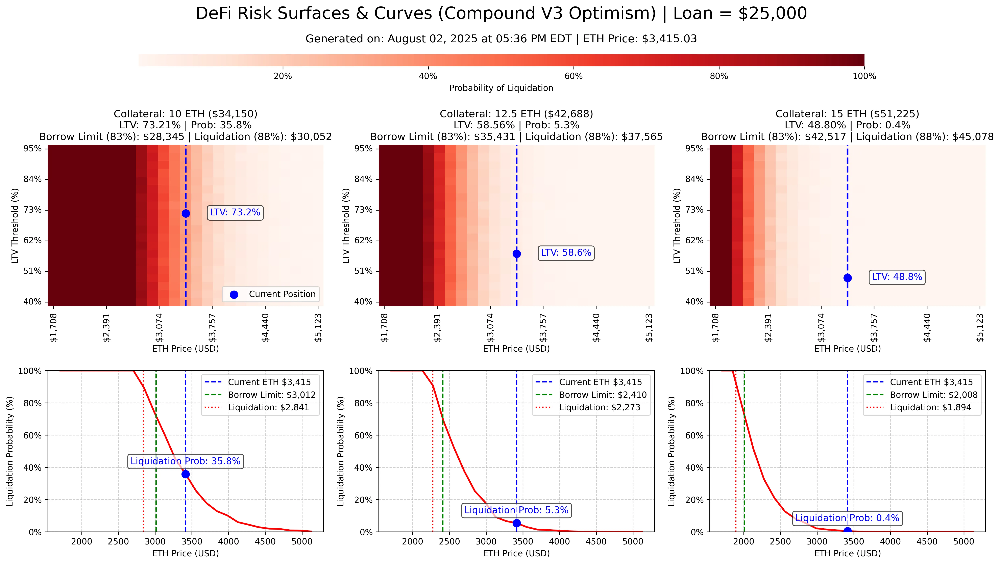
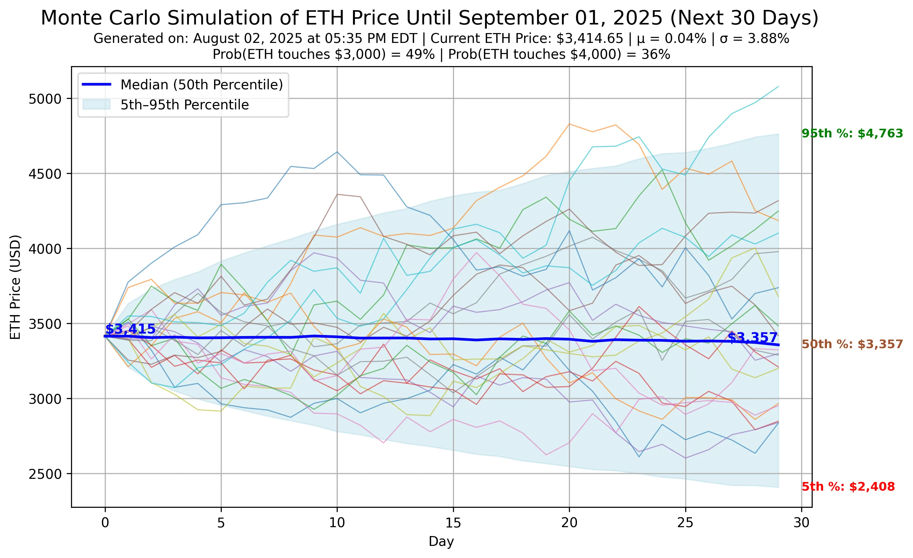
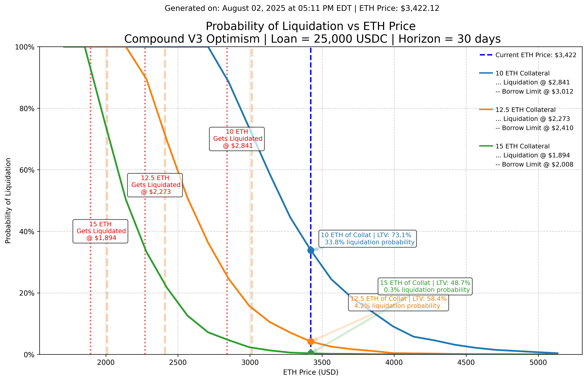

# Table of Contents <!-- omit from toc -->
- [DeFi Liquidation Risk Modeling with Monte Carlo Simulation](#defi-liquidation-risk-modeling-with-monte-carlo-simulation)
  - [About This Repo and Me (https://github.com/codesport)](#about-this-repo-and-me-httpsgithubcomcodesport)
    - [About Me](#about-me)
  - [Takeaways](#takeaways)
  - [Visualizations](#visualizations)
    - [1. Risk Surfaces \& Curves](#1-risk-surfaces--curves)
    - [2. Monte Carlo Simulation of ETH Price Paths](#2-monte-carlo-simulation-of-eth-price-paths)
    - [3. Probability of Liquidation vs ETH Price](#3-probability-of-liquidation-vs-eth-price)
  - [Quantitative \& Financial Theory](#quantitative--financial-theory)
  - [🛠 Tools \& Libraries](#-tools--libraries)
  - [Practical Applications](#practical-applications)
  - [Other Models: Sigmoid Curve4,5](#other-models-sigmoid-curve45)

# DeFi Liquidation Risk Modeling with Monte Carlo Simulation  
*A Quantitative Research Project using ETH and Compound V3 Parameters*  

---

## About This Repo and Me (https://github.com/codesport)

THIS REPO IS STILL IN DRAFT.  I STILL NEED TO MAP MATH EQUATIONS TO PYTHON CODE in the [Quantitative \& Financial Theory](#quantitative--financial-theory) 

This repository demonstrates the type of financial risk management work I do for clients at my current company.  In a nutshell, I apply traditional **quantitative finance techniques** to Decentralized Finance (DeFi) risk management.  

Using **Monte Carlo simulation** with **Geometric Brownian Motion (GBM)**, I modeled the probability of liquidation for ETH‑backed loans on **Compound V3 Optimism**

### About Me

If you're reading this you received a copy of my resume. Let's have a conversation!

Feel free to reach me through [Code Sport's contact us page](https://codesport.io/contact-us). 

Or better yet, just set up time on [our Calendly](https://calendly.com/codesport)

---

## Takeaways

- **Collateral Size Drives Risk**
  - 10 ETH Collateral → ~36% liquidation risk over 30 days  
  - 12.5 ETH Collateral → ~5%  
  - 15 ETH Collateral → <1%  

- **Compound V3 Risk Parameters**
  - **Borrow Limit (Collateral Factor)**: 83%  
  - **Liquidation Threshold**: 88%  
  - Borrowing close to the liquidation threshold sharply increases tail risk.  

- **Monte Carlo Simulation Results**
  - ~49% probability ETH touches **$3,000** in the next 30 days  
  - ~36% probability ETH touches **$4,000** in the same horizon  
  - Highlights the importance of hedging for *both downside and upside volatility*.  

---

## Visualizations

### 1. Risk Surfaces & Curves  
*Liquidation probability across ETH price ranges and LTV thresholds*  

---

### 2. Monte Carlo Simulation of ETH Price Paths  
*30‑day ETH projections with 5th–95th percentile bands*  

---

### 3. Probability of Liquidation vs ETH Price  
*Direct comparison across collateral sizes (10, 12.5, 15 ETH)*  

---

## Quantitative & Financial Theory

- **Geometric Brownian Motion (GBM)**  

$$
S_{t+1} = S_t \cdot \exp\left((\mu - \tfrac{1}{2}\sigma^2)\Delta t + \sigma \sqrt{\Delta t} \cdot Z\right), \quad Z \sim N(0,1)
$$

- **Loan-to-Value (LTV)**  
  $$
  LTV_t = \frac{\text{Loan USD}}{\text{Collateral Amount} \times S_t}
  $$ 
  - Liquidation occurs if:
   $$
   LTV_t \geq \text{liq\_factor}
   $$

- **Monte Carlo Simulation**  
  - Thousands of ETH price paths are generated to estimate the probability of hitting liquidation thresholds.  
  - Captures **path-dependent risk** often missed by static stress tests.  

---

## 🛠 Tools & Libraries

- **Python 3**  
- **Pandas** for time series data  
- **Matplotlib & Seaborn** for visualization  
- **NumPy** for vectorized simulations  
- **CoinGecko API** for historical ETH data  

---

## Practical Applications

- **For Borrowers**: Understand the probability of liquidation over a chosen horizon.  
- **For Protocol Designers**: Calibrate **collateral factors** and **liquidation thresholds**.  
- **For Quant Traders**: Hedge against liquidation cascades and market stress events.  

---

## Other Models: Sigmoid Curve4,5 

I do not use these in my work, but many protocols use them to assist with incentive design: 

- Token Supply Bonding Curves: Token Price vs Supply4,5
     $$
     Price(Supply) = \frac{L}{1 + e^{-k \cdot (Supply - x_{0})}}
     $$  

    Where:  
    - \(L\) = maximum (ceiling) price  
    - \(x_{0}\) = supply inflection point  
    - \(k\) = steepness of the curve  
  
- Borrowing rates
- Liquidation penalties
- Collateral factor adjustments
- Protocol Health:
    $$
    P(LTV) = \frac{1}{1 + e^{-k \cdot (LTV - LTV_{0})}}
    $$ 

---

References:
1. [Marcos A.B. at Code Sport Labs](https://github.com/codesport/monte-carlo)
2. Wilmott, Howison & Dewynne — The Mathematics of Financial Derivatives (Ch. 7 on barrier options)
3. Gauntlet: *[Risk Modeling Primer](https://gauntlet.network/research)* 
4. Chaos Labs: *["Simulating Liquidation Risk in DeFi Lending Protocols](https://chaoslabs.xyz/blog)*
5. Monte Carlo First-Passage Probability: Redner, "A Guide to First-Passage Processes" (2001).
6. [Google SERP](https://www.google.com/search?q=Do+DeFi+protocols+use+"sigmoid"+curves+to+model+risk)
7. [Crypto Bonding Curve: A Complete Guide to Token Pricing and Distribution](https://tokenminds.co/blog/knowledge-base/crypto-bonding-curve) 
